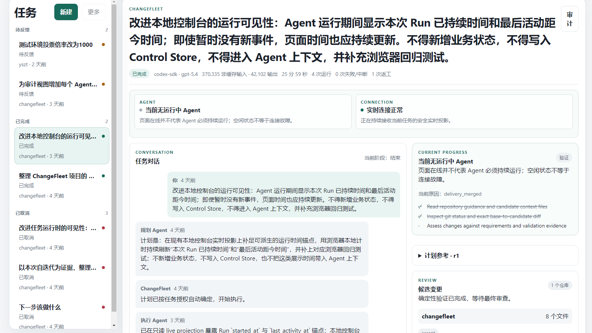
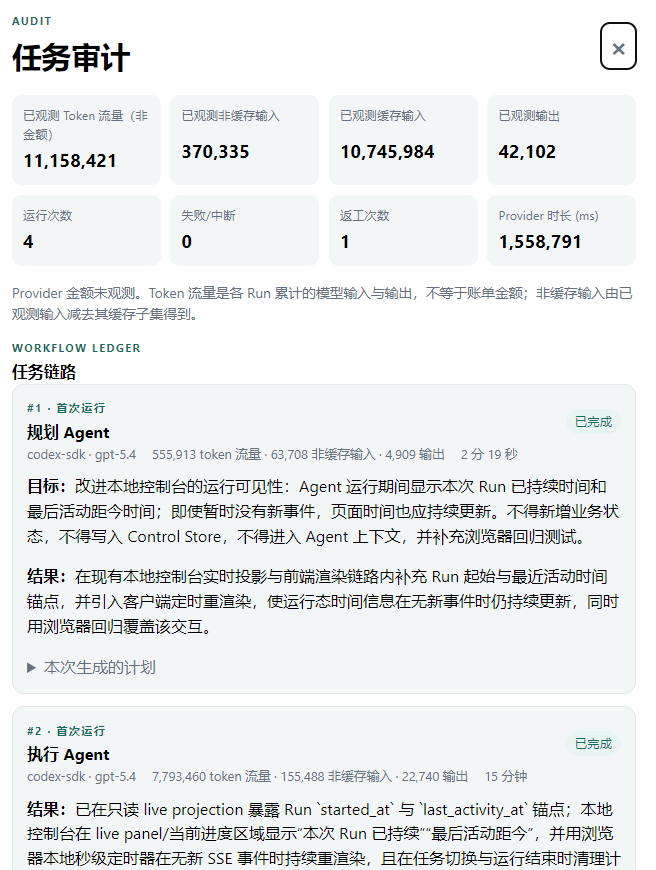

# ChangeFleet

[简体中文](README.md) | [English](README.en.md)

> **In one sentence:** A local-first control plane built to orchestrate, compare, and audit coding
> agents across isolated Git workspaces—from one task objective to a reviewable change spanning one
> or more repositories.

ChangeFleet is a local, spec-first control plane for coordinated and auditable Git changes across
one or more repositories.

Coding Agent Runtimes perform repository analysis, planning, implementation, and task-specific
checks. ChangeFleet gives that work an isolated workspace and preserves the control facts that must
remain reliable: authorized repositories and refs, exact Git subjects, Runtime evidence, human
decisions, review, recovery, and delivery state.

> **Project status:** ChangeFleet is an unreleased local prototype. Its CLI, HTTP surface, storage
> schema, and operator workflow are not stable public contracts.

## Console Preview

Follow multiple tasks, Agent conversations, current progress, and review state from one local
console.



Open the audit view only when needed to inspect each workflow step, its outcome, Runtime usage,
elapsed time, retries, and repair cycles.



## Vision

**Run a fleet of coding agents, not a pile of terminals.**

ChangeFleet aims to become a provider-neutral control plane where one clear objective can mobilize
the right Agents, models, repositories, and quality gates—then keep the work moving until it is
ready to integrate. Simple tasks should finish without supervision; complex tasks should interrupt
a human only when judgment, authority, or risk truly requires it.

- **Bring your own Agents and models.** Choose Codex, Claude Code, or future Runtimes independently
  for planning, implementation, review, and specialist work instead of locking a task to one vendor.
- **Parallel work by design.** Run many independent tasks in isolated workspaces, or let several
  Agents collaborate on one change without colliding with unrelated work.
- **Competing Candidate lanes.** Give the same task to different Agents or models, preserve each
  exact result, and select the strongest Candidate instead of trusting the first answer.
- **Evidence-based comparison.** Compare quality, checks, elapsed time, token and cost coverage,
  retries, repair cycles, and human intervention across Agents, models, and context strategies.
- **Autonomy with bounded authority.** Let Agents plan, implement, verify, review, repair, and—when
  explicitly authorized—integrate changes, while deterministic controls protect repository scope,
  permissions, budgets, and exact Git subjects.
- **One outcome across many repositories.** Coordinate frontend, backend, services, migrations, and
  documentation as one coherent change without losing per-repository identity or recovery paths.
- **Smarter model routing over time.** Use historical evidence to choose the cheapest adequate
  model for routine work and stronger models or additional reviewers where risk justifies them.
- **Replaceable intelligence, durable accountability.** Change the Agent or model without losing
  task history, exact artifacts, decisions, cost lineage, or the evidence behind an outcome.

This is the product direction, not a claim that every capability is implemented today. The
following sections describe the current prototype.

## Features

- **One task, one persistent workspace.** A ChangeSet may link one or more repository workspaces
  without turning repositories into separate user-facing tasks.
- **Exact Git identity.** Every repository starts from a frozen base SHA. Candidates, checks,
  review, and delivery remain bound to exact Git subjects.
- **Isolated execution.** Writable work happens in ChangeFleet-owned Git worktrees. Planning and
  independent review use read-only or disposable subjects.
- **Conversational task flow.** The local console creates tasks, carries planning and feedback in
  one conversation, and advances authorized work in the background.
- **Risk-adaptive verification.** Structural Git checks are mandatory. Repository-native semantic
  checks and independent Agent review are selected only when the task and policy require them.
- **Bounded multi-Agent quality checks.** A separate read-only reviewer may inspect one exact
  CandidateBundle and return passage, feedback, or a human decision request.
- **Out-of-context audit.** Runtime usage, duration, retries, evidence, and detailed artifacts are
  retained for audit without being replayed into later Agent context by default.
- **Repository-owned Harness.** ChangeFleet reads a repository's own instructions and verification
  guidance from the exact base; it does not invent or write back a project Harness.
- **GitHub delivery.** The current delivery adapter publishes an accepted exact Candidate through a
  ready pull request and observes the human merge result.
- **Exact integration grants.** After Bundle acceptance, an operator may grant one fully displayed,
  non-force Git publication or target fast-forward. ChangeFleet admits the result only after an
  independent remote-ref observation, or the operator may finish explicitly without managed
  integration.
- **Localized operator diagnostics.** The local UI and typed diagnostics support English and
  Simplified Chinese.

## How It Works

```text
task objective
  -> freeze repositories, branches, and base SHAs
  -> prepare one persistent task workspace
  -> plan and execute with an Agent Runtime
  -> validate exact repository Candidates
  -> optionally run independent review and repair
  -> review one exact cross-repository CandidateBundle
  -> publish configured PR delivery or grant one exact Git action
  -> independently observe the result, or finish without claiming managed integration
```

The current operator inbox derives six simple states from exact control facts:
`running`, `needs_feedback`, `needs_review`, `waiting_for_merge`, `complete`, and `cancelled`.

## Requirements

- Node.js 24
- Git
- An installed and authenticated local Codex environment, or an OpenAI API key
- `gh` authentication only when using the current GitHub delivery adapter

The first Runtime adapter uses `@openai/codex-sdk`. Credentials stay in the selected host-managed
environment and are not copied into ChangeFleet state.

## Quick Start

### 1. Install dependencies

```powershell
npm install
```

### 2. Create a local configuration

Save the following as `changefleet.json` and replace `codex_home` and `model` with values available
on your machine. Relative control and workspace paths resolve from the configuration file.

```json
{
  "schema_version": 1,
  "control_root": "./control",
  "workspace_root": "./workspaces",
  "locale": "en",
  "runtime": {
    "adapter": "codex-sdk",
    "credential_source": "local_codex_home",
    "codex_home": "C:/Users/example/.codex"
  },
  "agent_profile": {
    "profile_id": "local-codex-profile",
    "revision": 1,
    "provider": "openai",
    "runtime": "codex-sdk",
    "model": "gpt-5.4",
    "reasoning": "medium",
    "permissions": "operation_scoped",
    "network_access": false,
    "skills": [],
    "credential_profile_id": "local-codex-credentials"
  }
}
```

`operation_scoped` is the constrained profile. For a trusted local workspace, `host_user` with
`network_access: true` runs the Agent as your local account; worktrees still isolate Git state but
are not an OS security boundary.

### 3. Register a project

Create `register-project.json`:

```json
{
  "idempotency_key": "register-example-project-1",
  "project": {
    "project_id": "example-project",
    "repositories": [
      {
        "repository_id": "app",
        "locator": {
          "path": "C:/code/example-app"
        }
      }
    ]
  }
}
```

Register it:

```powershell
node ./bin/changefleet.js project register --config changefleet.json --request register-project.json
```

A Project may contain one repository or several repositories that belong to the same product or
change boundary.

### 4. Start the local console

```powershell
node ./bin/changefleet.js serve --config changefleet.json --port 4311
```

Open `http://127.0.0.1:4311`, create a task for the registered Project, and follow its conversation
and status from the task inbox.

Without a confirmed GitHub delivery binding, an accepted Bundle may use one exact non-force Git
publication or fast-forward grant, or finish explicitly without claiming that ChangeFleet delivered
or integrated it. A real remote write still requires a separate operator grant over the fully
displayed remote, ref, and Candidate.

## Useful Commands

```powershell
# Read one task
node ./bin/changefleet.js changeset show <change_set_id> --config changefleet.json

# Read bounded audit details
node ./bin/changefleet.js debug audit changeset <change_set_id> --control-root ./control --locale en

# Run repository development checks
npm test
npm run test:integration
npm run test:acceptance
npm run test:ui
npm run check
```

Low-level lifecycle commands are maintained diagnostic and integration surfaces. The local console
is the ordinary task flow.

## Current Limitations

- GitHub is the only implemented PR delivery provider, and a human performs the PR merge. A
  provider-neutral, per-action exact Git publication and fast-forward route also exists, but there
  is no generic external-write grant.
- Remote workers, deployment, merge queues, automatic merge, and hosted multi-tenancy are not
  implemented.
- The Codex Runtime is the only real Provider adapter currently implemented.
- Simultaneous Provider dispatch across independent repository WorkUnits is not yet proven.
- This prototype accepts only its current exact filesystem storage schema.

See [current state](docs/current-state.md) for the precise implementation projection and open gaps.

## Documentation

- [Product specification](SPEC.md)
- [Current implementation state](docs/current-state.md)
- [Architecture](docs/architecture.md)
- [Repository Harness](docs/harness.md)
- [Validation policy](docs/validation.md)
- [Glossary](docs/glossary.md)
- [Accepted decisions](docs/decisions/README.md)
- [Design proposal index](docs/proposals/INDEX.md)

For an Agent task, apply [AGENTS.md](AGENTS.md), read current state and the active WorkItem or
Proposal, inspect the Git diff, and load only the relevant specification and decision sections.

## Development

ChangeFleet is a private Node.js 24 ESM package. Use the smallest validation scope that covers the
final diff; [docs/validation.md](docs/validation.md) defines the selection rules. Real Provider and
external GitHub checks are opt-in gates and are not implied by `npm run check`.
